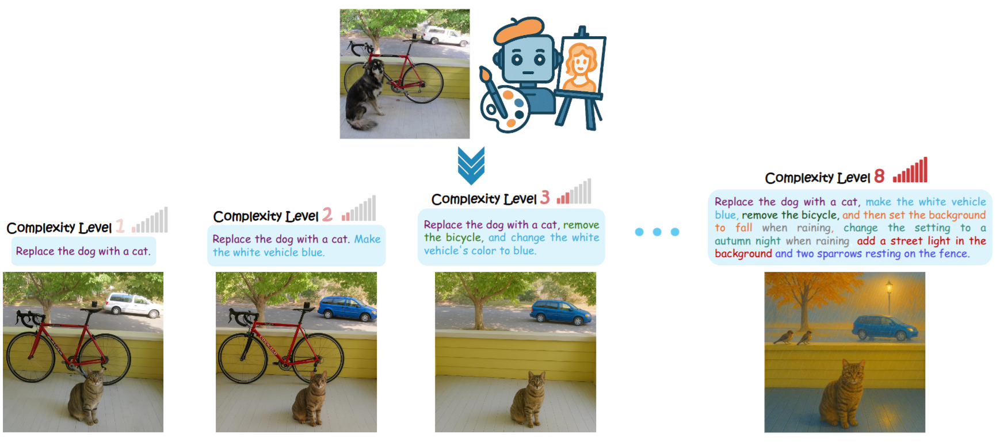

# Complex-Edit: CoT-Like Instruction Generation for Complexity-Controllable Image Editing Benchmark




We introduce Complex-Edit, a comprehensive benchmark designed to systematically evaluate instruction-based image editing models across instructions of varying complexity. To develop this benchmark, we harness GPT-4o to automatically collect a diverse set of editing instructions at scale.

Our approach follows a well-structured “Chain-of-Edit” pipeline: we first generate individual atomic editing tasks independently and then integrate them to form cohesive, complex instructions. Additionally, we introduce a suite of metrics to assess various aspects of editing performance, along with a VLM-based auto-evaluation pipeline that supports large-scale assessments.

Our benchmark yields several notable insights:

1. Open-source models significantly underperform relative to proprietary, closed-source models, with the performance gap widening as instruction complexity increases;
2. Increased instructional complexity primarily impairs the models' ability to retain key elements from the input images and to preserve the overall aesthetic quality;
3. Decomposing a complex instruction into a sequence of atomic steps, executed in a step-by-step manner, substantially degrades performance across multiple metrics;
4. A straightforward Best-of-N selection strategy improves results for both direct editing and the step-by-step sequential approach;
5. We observe a “curse of synthetic data”: when synthetic data is involved in model training, the edited images from such models tend to appear increasingly synthetic as the complexity of the editing instructions rises — a phenomenon that intriguingly also manifests in the latest GPT-4o outputs.

---

## **Links**
- [📄 Paper (arXiv)](https://arxiv.org/abs/2504.13143)  
- [🤗 Dataset on HuggingFace](https://huggingface.co/datasets/UCSC-VLAA/Complex-Edit)  
- [🌐 Project Page](https://ucsc-vlaa.github.io/Complex-Edit/)

---

## **Dataset Generation**
```bash
python build_dataset/generate_edits.py -p <path_to_input_image_dir> -o <path_to_output_dir> --max-complexity 8
```

## **Evaluation**
```bash
python eval.py --image-type <real_or_syn> -p <path_to_output_image_dir> -c <complexity> --resume --num-processes 16
```

---
## Acknowledgement

We would like to thank Google Cloud Research Credits Program, and the Microsoft Accelerate Foundation Models Research Program for supporting our computing needs.

---

## **Citation**

If you use our work, please cite it:

```bibtex
@article{yang2025complexedit,
    title={Complex-Edit: CoT-Like Instruction Generation for Complexity-Controllable Image Editing Benchmark},
    author={Yang, Siwei and Hui, Mude and Zhao, Bingchen and Zhou, Yuyin and Ruiz, Nataniel and Xie, Cihang},
    journal={arXiv preprint arXiv:2504.13143},
    year={2025}
}
